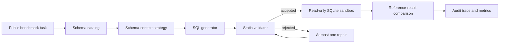

# SchemaSafeBench

SchemaSafeBench is a reproducible evaluation harness for one question:

> Do schema retrieval, SQL validation, bounded repair, and abstention make text-to-SQL systems more dependable than direct full-schema prompting?

The project evaluates generated SQLite queries against trusted reference queries on public benchmarks. Reference SQL is used only by the evaluator and is never included in generation prompts.

## Evaluation loop



SchemaSafeBench is an evaluation system, not a SQL chatbot, a new dataset, a foundation model, or a production authorization layer.

## Scope

- Primary benchmark: BIRD Mini-Dev SELECT-only tasks.
- Execution target: local public SQLite databases opened read-only.
- Methods: full schema, truncated schema, BM25, dense, hybrid, optional reranking, validation with one repair, and validation with abstention.
- Measurements: execution correctness, identifier validity, schema-evidence quality, policy violations, repair gain, abstention behavior, context size, request latency, and estimated provider cost.
- Data boundary: no Oracle or other proprietary code, schemas, SQL, screenshots, documents, metrics, or customer information.

## Quick start

Requirements: Python 3.12 and [`uv`](https://docs.astral.sh/uv/).

```bash
git clone git@github.com:nkmohit/schema-safe-bench.git
cd schema-safe-bench
uv sync --dev
uv run schema-safe-bench --help
uv run pytest
```

The test suite and committed example run are self-contained. Public benchmark databases are downloaded separately and are never committed:

```bash
uv run schema-safe-bench dataset inspect --help
uv run schema-safe-bench catalog build --help
uv run schema-safe-bench run smoke --help
```

See [data/README.md](data/README.md) for the expected BIRD layout and [docs/reproducibility.md](docs/reproducibility.md) for the complete run sequence.

Install the optional dense-retrieval stack only for experiments that use a documented local embedding model:

```bash
uv sync --extra dense --dev
```

## Methods

| ID | Schema context | Reliability behavior |
|---|---|---|
| B0 | Full catalog | Direct baseline |
| B1 | Length-truncated catalog | Context-pressure baseline |
| B2 | BM25 retrieval | Lexical retrieval |
| B3 | Dense retrieval | Semantic retrieval |
| B4 | Hybrid retrieval | Lexical and semantic fusion |
| B5 | Hybrid plus reranking | Candidate refinement |
| B6 | Hybrid retrieval | Validation and one bounded repair |
| B7 | Hybrid retrieval | Validation and abstention |

All comparisons must use the same task set, model configuration, prompt contract, and execution policy. See [docs/experiment-protocol.md](docs/experiment-protocol.md).

## Repository map

```text
configs/                 Versioned dataset, method, and run settings
data/                    Download instructions; benchmark data is ignored
docs/                    Architecture, protocol, safety, and research notes
results/                 Small, reviewable sample artifacts only
scripts/                 Thin operational entry points
src/schema_safe_bench/   Benchmark implementation
tests/                   Offline unit and integration tests
```

## Current results

No benchmark performance claim is published until the corresponding configuration, raw traces, aggregation code, and task exclusions are reviewable. The committed sample artifact demonstrates the output format only; it is not a benchmark score.

## Responsible use and limitations

The validator and SQLite sandbox provide defense in depth for controlled experiments. They are not a substitute for database permissions, workload isolation, query review, or production security controls. Generated SQL can execute successfully and still be semantically wrong.

See [docs/safety-policy.md](docs/safety-policy.md), [SECURITY.md](SECURITY.md), and [LICENSE](LICENSE).

## Citation

Citation metadata is available in [CITATION.cff](CITATION.cff). Dataset users must also cite and comply with the terms of the upstream benchmark.
