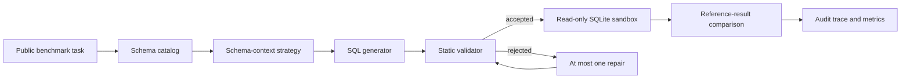

# SchemaSafeBench

[](https://github.com/nkmohit/schema-safe-bench/actions/workflows/ci.yml)
[](https://www.python.org/)
[](LICENSE)

SchemaSafeBench is a reproducible evaluation harness for one question:

> Do schema retrieval, SQL validation, bounded repair, and abstention make text-to-SQL systems more dependable than direct full-schema prompting?

The project evaluates generated SQLite queries against trusted reference queries on public benchmarks. Reference SQL is used only by the evaluator and is never included in generation prompts.

## Evaluation loop



SchemaSafeBench is an evaluation system, not a SQL chatbot, a new dataset, a foundation model, or a production authorization layer.

## Scope

- Primary benchmark: BIRD Mini-Dev SELECT-only tasks.
- Execution target: local public SQLite databases opened read-only.
- Methods: full schema, truncated schema, BM25, dense, hybrid, optional reranking, validation with one repair, and validation with abstention.
- Measurements: execution correctness, identifier validity, schema-evidence quality, policy violations, repair gain, abstention behavior, context size, request latency, and estimated provider cost.
- Data boundary: no Oracle or other proprietary code, schemas, SQL, screenshots, documents, metrics, or customer information.

## Quick start

Requirements: Python 3.12 and [`uv`](https://docs.astral.sh/uv/).

```bash
git clone git@github.com:nkmohit/schema-safe-bench.git
cd schema-safe-bench
uv sync --dev
uv run schema-safe-bench --help
uv run pytest
```

The test suite and committed example run are self-contained. Public benchmark databases are downloaded separately and are never committed:

```bash
uv run schema-safe-bench dataset inspect --help
uv run schema-safe-bench catalog build --help
uv run schema-safe-bench run smoke --help
```

See [data/README.md](data/README.md) for the expected BIRD layout and [docs/reproducibility.md](docs/reproducibility.md) for the complete run sequence.

The hosted-generation path uses a locally configured OpenAI credential and `gpt-5.6-luna`, with a project spend guard and deterministic response replay. B0 supplies the full schema, B1 applies a provenance-locked 1,000-character catalog-prefix policy, B2 applies BM25 schema retrieval, B3 applies revision-pinned local dense retrieval, B4 applies locked reciprocal-rank fusion over B2 and B3, and B5 locally reranks a fixed B4 candidate set. See [docs/hosted-generation.md](docs/hosted-generation.md). No hosted API calls run in CI.

Install the optional local-model stack only for experiments that use the documented embedding model or reranker:

```bash
uv sync --extra dense --dev
uv run schema-safe-bench retrieval cache-model \
  --config configs/runs/b5-openai-luna-smoke.yaml
```

## Methods

| ID | Schema context | Reliability behavior |
|---|---|---|
| B0 | Full catalog | Direct baseline |
| B1 | Length-truncated catalog | Context-pressure baseline |
| B2 | BM25 retrieval | Lexical retrieval |
| B3 | Dense retrieval | Semantic retrieval |
| B4 | Hybrid retrieval | Lexical and semantic fusion |
| B5 | Hybrid plus reranking | Candidate refinement |
| B6 | Hybrid retrieval | Validation and one bounded repair |
| B7 | Hybrid retrieval | Validation and abstention |

All comparisons must use the same task set, model configuration, prompt contract, and execution policy. See [docs/experiment-protocol.md](docs/experiment-protocol.md).

Primary execution accuracy uses the checksum-pinned official BIRD set-equivalence semantics. The reproducible compatibility gate and its limitations are documented in [docs/evaluator-compatibility.md](docs/evaluator-compatibility.md).

## Repository map

```text
configs/                 Versioned dataset, method, and run settings
data/                    Download instructions; benchmark data is ignored
docs/                    Architecture, protocol, safety, and research notes
results/                 Small, reviewable sample artifacts only
scripts/                 Thin operational entry points
src/schema_safe_bench/   Benchmark implementation
tests/                   Offline unit and integration tests
```

## Current results

No benchmark performance claim is published until the corresponding configuration, raw traces, aggregation code, and task exclusions are reviewable. The committed sample artifact demonstrates the output format only; it is not a benchmark score.

Evaluator compatibility is verified independently of model performance: 7/7 semantic edge cases and 20/20 committed smoke tasks match the pinned official BIRD evaluator behavior.

The first hosted B0 smoke artifact uses `gpt-5.6-luna` on the same 20 tasks. It records 6 correct results, 10 semantic mismatches, 2 safe abstentions, and 2 bounded-execution interruptions at an estimated token cost of `$0.019454`. This is a pipeline smoke result, not a complete benchmark score. See [results/b0-openai-gpt-5-6-luna-smoke](results/b0-openai-gpt-5-6-luna-smoke/README.md).

The paired B1 smoke artifact applies the locked 1,000-character catalog-prefix policy. It records 4 correct results, 7 semantic mismatches, 6 safe abstentions, and 3 validator rejections at an estimated token cost of `$0.013395`. The paired comparison shows lower context and cost but two correctness regressions and no improvements; see [results/b0-vs-b1-openai-gpt-5-6-luna-smoke](results/b0-vs-b1-openai-gpt-5-6-luna-smoke/README.md).

The B2 smoke artifact applies the locked 12-hit BM25 schema-retrieval policy. It records 2 correct results, 6 semantic mismatches, 10 safe abstentions, and 2 validator rejections at an estimated token cost of `$0.011538`. Evaluator-only evidence finds complete required-table coverage on 10 tasks and complete required-column coverage on 8; see [results/b2-openai-gpt-5-6-luna-smoke](results/b2-openai-gpt-5-6-luna-smoke/README.md).

The B3 smoke artifact applies the revision-pinned 12-hit BGE dense-retrieval policy. It records 3 correct results, 7 semantic mismatches, 9 safe abstentions, and 1 validator rejection at an estimated token cost of `$0.011297`. Evaluator-only evidence finds complete required-table coverage on 13 tasks and complete required-column coverage on 9; see [results/b3-openai-gpt-5-6-luna-smoke](results/b3-openai-gpt-5-6-luna-smoke/README.md).

The B4 smoke artifact applies the locked 12-hit reciprocal-rank fusion policy over complete B2 and B3 rankings. It records 3 correct results, 9 semantic mismatches, 6 safe abstentions, 1 validator rejection, and 1 bounded execution interruption at an estimated token cost of `$0.013090`. Evaluator-only evidence finds complete required-table coverage on 14 tasks and complete required-column coverage on 10; see [results/b4-openai-gpt-5-6-luna-smoke](results/b4-openai-gpt-5-6-luna-smoke/README.md).

The B5 smoke artifact reranks up to 48 B4 candidates with the pinned local MiniLM cross-encoder before selecting 12 hits. It records 2 correct results, 8 semantic mismatches, 8 safe abstentions, and 2 validator rejections at an estimated token cost of `$0.010070`. Evaluator-only evidence finds complete required-table coverage on 11 tasks and complete required-column coverage on 8; see [results/b5-openai-gpt-5-6-luna-smoke](results/b5-openai-gpt-5-6-luna-smoke/README.md).

## Responsible use and limitations

The validator and SQLite sandbox provide defense in depth for controlled experiments. They are not a substitute for database permissions, workload isolation, query review, or production security controls. Generated SQL can execute successfully and still be semantically wrong.

See [docs/safety-policy.md](docs/safety-policy.md), [SECURITY.md](SECURITY.md), and [LICENSE](LICENSE).

The implementation sequence and acceptance checks are in [docs/project-plan.md](docs/project-plan.md).

## Citation

Citation metadata is available in [CITATION.cff](CITATION.cff). Dataset users must also cite and comply with the terms of the upstream benchmark.
