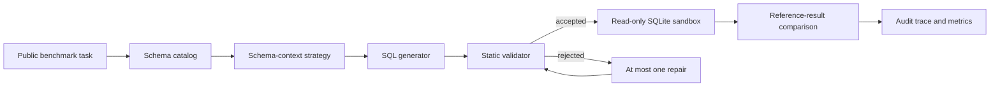

# SchemaSafeBench

[](https://github.com/nkmohit/schema-safe-bench/actions/workflows/ci.yml)
[](https://www.python.org/)
[](LICENSE)

SchemaSafeBench is a reproducible evaluation harness for one question:

> Do schema retrieval, SQL validation, bounded repair, and abstention make text-to-SQL systems more dependable than direct full-schema prompting?

The project evaluates generated SQLite queries against trusted reference queries on public benchmarks. Reference SQL is used only by the evaluator and is never included in generation prompts.

## Evaluation loop



SchemaSafeBench is an evaluation system, not a SQL chatbot, a new dataset, a foundation model, or a production authorization layer.

## Scope

- Primary benchmark: BIRD Mini-Dev SELECT-only tasks.
- Execution target: local public SQLite databases opened read-only.
- Methods: full schema, truncated schema, BM25, dense, hybrid, optional reranking, validation with one repair, and validation with abstention.
- Measurements: execution correctness, identifier validity, schema-evidence quality, policy violations, repair gain, abstention behavior, context size, request latency, and estimated provider cost.
- Data boundary: no Oracle or other proprietary code, schemas, SQL, screenshots, documents, metrics, or customer information.

## Quick start

Requirements: Python 3.12 and [`uv`](https://docs.astral.sh/uv/).

```bash
git clone git@github.com:nkmohit/schema-safe-bench.git
cd schema-safe-bench
uv sync --dev
uv run schema-safe-bench --help
uv run pytest
```

The test suite and committed example run are self-contained. Public benchmark databases are downloaded separately and are never committed:

```bash
uv run schema-safe-bench dataset inspect --help
uv run schema-safe-bench catalog build --help
uv run schema-safe-bench run smoke --help
```

See [data/README.md](data/README.md) for the expected BIRD layout and [docs/reproducibility.md](docs/reproducibility.md) for the complete run sequence.

The complete 500-task, 11-database B0-B7 protocol is frozen with deterministic manifests,
database provenance, replay-safe configurations, and a machine-readable readiness report. See
[docs/full-evaluation-freeze.md](docs/full-evaluation-freeze.md).

The hosted-generation path uses a locally configured OpenAI credential and `gpt-5.6-luna` with deterministic response replay. B0 supplies the full schema, B1 applies a provenance-locked 1,000-character catalog-prefix policy, B2 applies BM25 schema retrieval, B3 applies revision-pinned local dense retrieval, B4 applies locked reciprocal-rank fusion over B2 and B3, and B5 locally reranks a fixed B4 candidate set. B6 and B7 reuse the exact B4 first pass for bounded repair and deterministic terminal abstention respectively. See [docs/hosted-generation.md](docs/hosted-generation.md). No hosted API calls run in CI.

Install the optional local-model stack only for experiments that use the documented embedding model or reranker:

```bash
uv sync --extra dense --dev
uv run schema-safe-bench retrieval cache-model \
  --config configs/runs/b5-openai-luna-smoke.yaml
```

## Methods

| ID | Schema context | Reliability behavior |
|---|---|---|
| B0 | Full catalog | Direct baseline |
| B1 | Length-truncated catalog | Context-pressure baseline |
| B2 | BM25 retrieval | Lexical retrieval |
| B3 | Dense retrieval | Semantic retrieval |
| B4 | Hybrid retrieval | Lexical and semantic fusion |
| B5 | Hybrid plus reranking | Candidate refinement |
| B6 | Hybrid retrieval | Validation and one bounded repair |
| B7 | Hybrid retrieval | Validation and abstention |

All comparisons must use the same task set, model configuration, prompt contract, and execution policy. See [docs/experiment-protocol.md](docs/experiment-protocol.md).

Primary execution accuracy uses the checksum-pinned official BIRD set-equivalence semantics. The reproducible compatibility gate and its limitations are documented in [docs/evaluator-compatibility.md](docs/evaluator-compatibility.md).

## Repository map

```text
configs/                 Versioned dataset, method, and run settings
data/                    Download instructions; benchmark data is ignored
docs/                    Architecture, protocol, safety, and research notes
results/                 Small, reviewable sample artifacts only
scripts/                 Thin operational entry points
src/schema_safe_bench/   Benchmark implementation
tests/                   Offline unit and integration tests
```

## Current results

No benchmark performance claim is published until the corresponding configuration, raw traces, aggregation code, and task exclusions are reviewable. The committed sample artifact demonstrates the output format only; it is not a benchmark score.

Evaluator compatibility is verified independently of model performance: 7/7 semantic edge cases and 20/20 committed smoke tasks match the pinned official BIRD evaluator behavior.

All rows below use `gpt-5.6-luna` on the same deterministic 20-task smoke manifest.

| Method | Schema policy | Correct | Accuracy | Semantic mismatch | Abstained | Validator rejection | Execution interruption | Estimated cost |
|---|---|---:|---:|---:|---:|---:|---:|---:|
| [B0](results/b0-openai-gpt-5-6-luna-smoke/README.md) | Full schema | 6 | 30% | 10 | 2 | 0 | 2 | `$0.019454` |
| [B1](results/b1-openai-gpt-5-6-luna-smoke/README.md) | 1,000-character catalog prefix | 4 | 20% | 7 | 6 | 3 | 0 | `$0.013395` |
| [B2](results/b2-openai-gpt-5-6-luna-smoke/README.md) | BM25 retrieval | 2 | 10% | 6 | 10 | 2 | 0 | `$0.011538` |
| [B3](results/b3-openai-gpt-5-6-luna-smoke/README.md) | Dense retrieval | 3 | 15% | 7 | 9 | 1 | 0 | `$0.011297` |
| [B4](results/b4-openai-gpt-5-6-luna-smoke/README.md) | Hybrid reciprocal-rank fusion | 3 | 15% | 9 | 6 | 1 | 1 | `$0.013090` |
| [B5](results/b5-openai-gpt-5-6-luna-smoke/README.md) | Hybrid plus local reranking | 2 | 10% | 8 | 8 | 2 | 0 | `$0.010070` |
| [B6](results/b6-openai-gpt-5-6-luna-smoke/README.md) | B4 plus one bounded repair | 3 | 15% | 9 | 7 | 1 | 0 | `$0.014768` total |
| [B7](results/b7-openai-gpt-5-6-luna-smoke/README.md) | B4 plus terminal abstention | 3 | 15% | 9 | 8 | 0 | 0 | `$0.013090` reused |

B1 reduced context size but produced two correctness regressions relative to B0. B2-B5 include evaluator-only schema-evidence reports in their linked artifacts. B6 attempted two eligible repairs without changing correctness. B7 removed the remaining unsafe terminal states while preserving B4 correctness and making no additional model request.

## Responsible use and limitations

The validator and SQLite sandbox provide defense in depth for controlled experiments. They are not a substitute for database permissions, workload isolation, query review, or production security controls. Generated SQL can execute successfully and still be semantically wrong.

See [docs/safety-policy.md](docs/safety-policy.md), [SECURITY.md](SECURITY.md), and [LICENSE](LICENSE).

The implementation sequence and acceptance checks are in [docs/project-plan.md](docs/project-plan.md).

## Citation

Citation metadata is available in [CITATION.cff](CITATION.cff). Dataset users must also cite and comply with the terms of the upstream benchmark.
