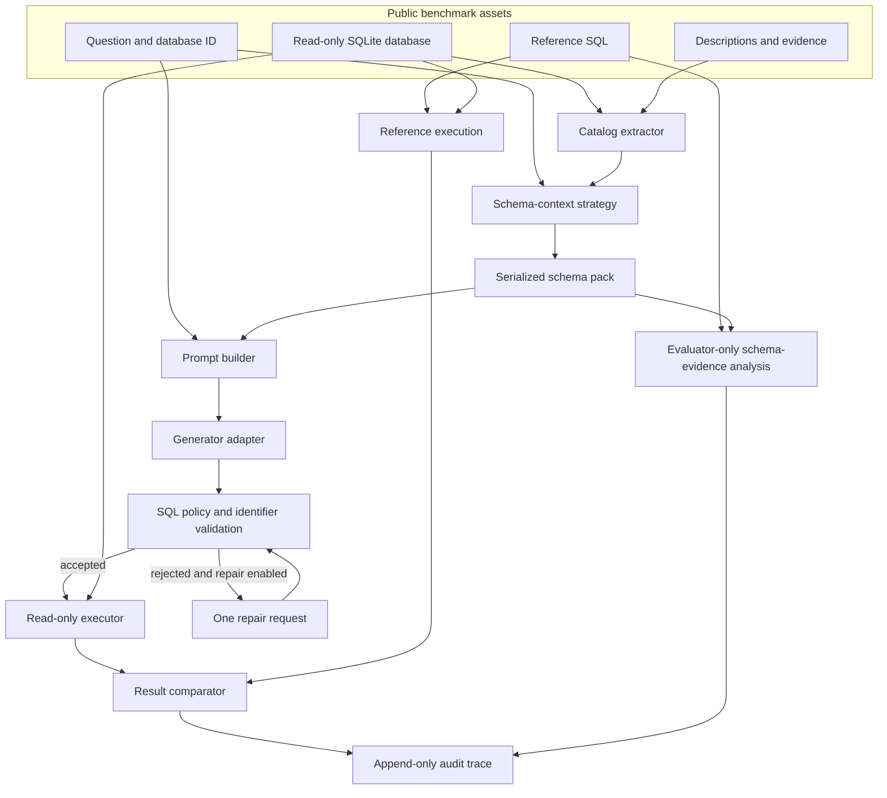

# Architecture

SchemaSafeBench separates benchmark data, schema context selection, SQL generation, policy validation, controlled execution, and evaluation. This keeps gold references out of prompts and makes each result auditable.

## Trust boundaries

1. Downloaded benchmark assets are untrusted inputs and remain outside version control.
2. Model output is untrusted text until it passes statement and identifier validation.
3. SQLite is opened through a read-only URI and protected by an authorizer, progress budget, and row cap.
4. Reference SQL is evaluator-only data. It cannot enter generation or repair payloads.
5. Schema-evidence analysis occurs after request construction and compares reference identifiers only with the already serialized prompt context.
6. Trace files distinguish raw output, extracted SQL, validation findings, execution outcome, and comparison outcome.

## Package boundaries

- `datasets`: normalize public task formats and validate asset paths.
- `catalog`: extract identifiers, keys, and join edges from SQLite.
- `retrieval`: rank schema documents and create bounded schema packs.
- `prompting`: build versioned prompts without evaluation references.
- `generation`: define provider-neutral request and response contracts.
- `validation`: parse one statement and enforce read-only and catalog policies.
- `execution`: execute accepted SQL under SQLite controls.
- `evaluation`: compare results and classify outcomes.
- `reporting`: write immutable traces and aggregate summaries.

Dependency direction follows this evaluation flow; provider adapters must not own validation or execution policy.

Dense, hybrid, and reranked retrieval use separately installed local model adapters. Model acquisition is an explicit cache-preparation operation; benchmark runs require immutable revisions to be present locally and verify the cached weights, tokenizer, and configuration files before inference. The adapters receive schema documents and the public question only. They have no task object or evaluator input.

B4 combines complete BM25 and dense document rankings with equal-weight reciprocal-rank fusion. Fusion operates only on document IDs, component ranks, and component scores produced from the public question and catalog. Reference SQL and evaluator outputs enter only after the hosted response has been fixed.

B5 sends a fixed top-48 B4 candidate list to a revision-pinned local cross-encoder. The cross-encoder scores only public-question/schema-document pairs. Reranking preserves the full first-stage record for every candidate and selects the top 12 through a stable frozen ordering. Prompt construction receives only the selected schema pack; candidate audit metadata is never inserted into the model prompt.

B6 consumes committed B4 first-pass artifacts rather than regenerating them. Repair eligibility is computed from validator and controlled-executor state before reference execution or semantic comparison. Eligible tasks receive at most one stage-bound request containing a normalized error; abstentions and successful executions cannot enter the repair branch. First-pass and repair recordings remain separate and independently digest checked.

B7 also consumes committed B4 first-pass artifacts, but makes no repair or additional model request. It preserves model abstentions and converts only validator rejection or controlled execution failure into a system-enforced terminal abstention. The decision occurs before evaluator data enters the pipeline; successful queries cannot be abstained from based on semantic mismatch.
