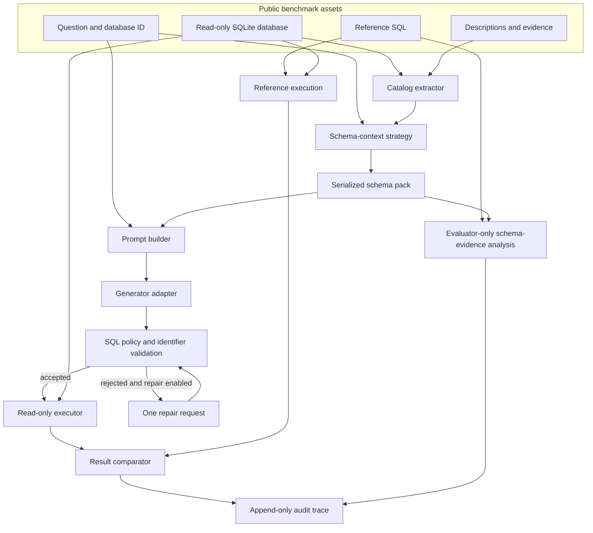

# Architecture

SchemaSafeBench separates benchmark data, schema context selection, SQL generation, policy validation, controlled execution, and evaluation. This keeps gold references out of prompts and makes each result auditable.

## Trust boundaries

1. Downloaded benchmark assets are untrusted inputs and remain outside version control.
2. Model output is untrusted text until it passes statement and identifier validation.
3. SQLite is opened through a read-only URI and protected by an authorizer, progress budget, and row cap.
4. Reference SQL is evaluator-only data. It cannot enter generation or repair payloads.
5. Schema-evidence analysis occurs after request construction and compares reference identifiers only with the already serialized prompt context.
6. Trace files distinguish raw output, extracted SQL, validation findings, execution outcome, and comparison outcome.

## Package boundaries

- `datasets`: normalize public task formats and validate asset paths.
- `catalog`: extract identifiers, keys, and join edges from SQLite.
- `retrieval`: rank schema documents and create bounded schema packs.
- `prompting`: build versioned prompts without evaluation references.
- `generation`: define provider-neutral request and response contracts.
- `validation`: parse one statement and enforce read-only and catalog policies.
- `execution`: execute accepted SQL under SQLite controls.
- `evaluation`: compare results and classify outcomes.
- `reporting`: write immutable traces and aggregate summaries.

Dependency direction follows this evaluation flow; provider adapters must not own validation or execution policy.

Dense retrieval uses a separately installed local model adapter. Model acquisition is an explicit cache-preparation operation; benchmark runs require the immutable revision to be present locally and verify the cached weights, tokenizer, and configuration before embedding. The adapter receives schema documents and the public question only. It has no task object or evaluator input.
